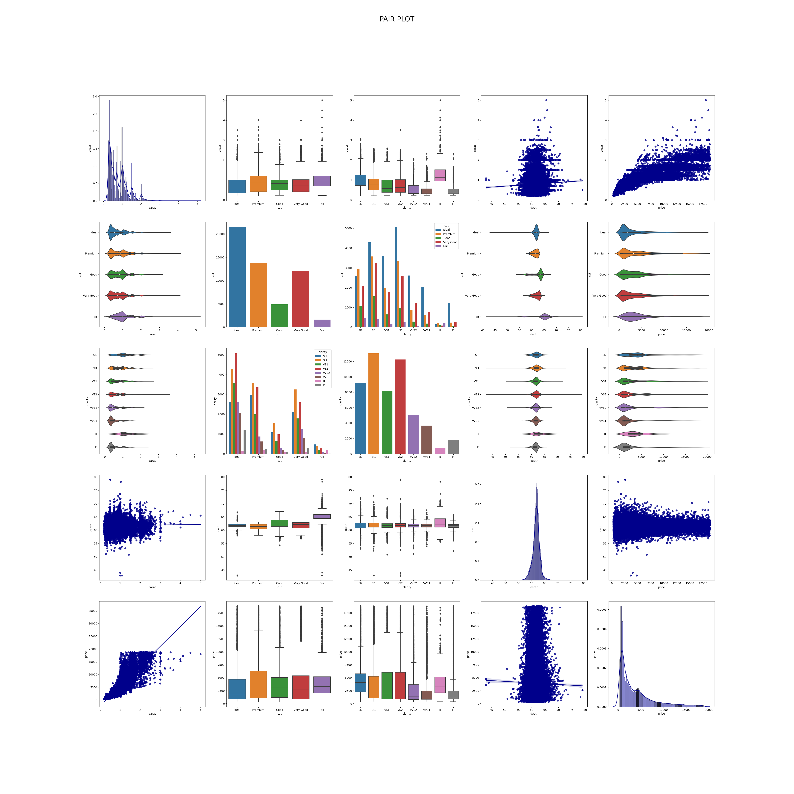
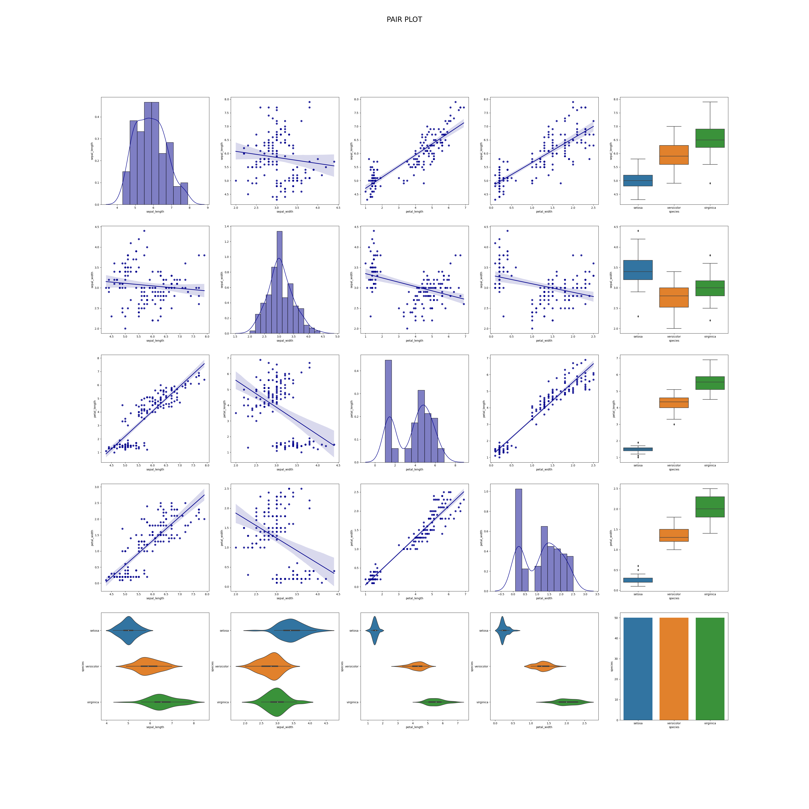

# pair_plot
 modified pair plot to show relationships in categorical values and numerical values
## sample plots:
* sample of **__DIAMONDS__** dataset

it can be easily used to show the relationship between the elements
* samnple of **__IRIS__** dataset

